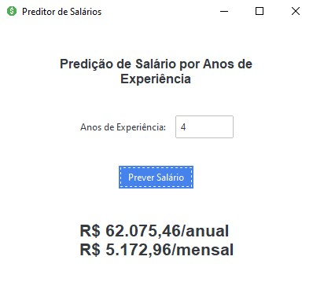

# 🤖 Preditor de Salários

Modelo de Machine Learning que prevê salários baseado em anos de experiência profissional, utilizando Regressão Linear.

## 📋 Sobre o Projeto

Este projeto utiliza Machine Learning para prever salários com base em anos de experiência profissional. O modelo foi treinado com dados extraídos do Kaggle e possui uma interface gráfica intuitiva para facilitar o uso.

## ✨ Demonstração

<p align="center">
    
</p>

## 🎯 Funcionalidades

- Previsão de salários baseada em anos de experiência
- Interface gráfica moderna desenvolvida com Tkinter e ttkbootstrap
- Visualização de salário anual e mensal
- Formatação automática em moeda brasileira (R$)
- Gráficos de análise do modelo

## 🔧 Tecnologias

- Python - Linguagem de programação
- scikit-learn - Biblioteca de Machine Learning
- Pandas - Manipulação de dados
- NumPy - Computação numérica
- Matplotlib - Visualização de dados
- Tkinter - Interface gráfica
- ttkbootstrap - Temas modernos para Tkinter
- joblib - Serialização do modelo

## ⚙️ Instalação

```bash
# Clone o repositório
git clone https://github.com/seu-usuario/preditor-salarios

# Entre no diretório
cd preditor-salarios

# Instale as dependências
pip install -r requirements.txt
```

## 🚀 Como Usar

1. Execute o arquivo principal:
```bash
python salary_prediction_app.py
```

2. Insira os anos de experiência
3. Clique em "Prever Salário"
4. O resultado será exibido em formato anual e mensal

## 📊 Dataset

O dataset (Salary_dataset.csv) contém:
- Anos de experiência profissional
- Salários correspondentes em R$
- 30 registros para treinamento (poucos dados)

## 📈 Métricas do Modelo

O modelo apresentou excelente desempenho, com alta correlação (0.96) e boa capacidade de explicação da variância (92%). Abaixo, as métricas detalhadas:

### 📊 Métricas de Avaliação
- **MSE (Erro Quadrático Médio)**: 49.830.096,86/anual
- **RMSE (Raiz do Erro Quadrático Médio)**: R$ 7.059,04/anual
- **MAE (Erro Médio Absoluto)**: R$ 6.286,45/anual
- **MAPE (Erro Percentual Médio)**: 7,74%
- **R² (Coeficiente de Determinação)**: 0,9024 (90,24% de acurácia)
- **Variância Explicada**: 0,9206 (92,06%)
- **Correlação de Pearson**: 0,9595 (95,95% de correlação)
- **Erro Máximo**: R$ 11.215,13/anual

### 🎯 Coeficientes do Modelo
- **Salário Base (Intercepto)**: R$ 24.380,20/anual
- **Aumento por Ano de Experiência**: R$ 9.423,82/anual

Estes resultados indicam que:
- O modelo explica 90,24% da variabilidade nos dados
- O erro médio nas previsões é de 7,74%
- Para cada ano de experiência adicional, o salário aumenta em média R$ 9.423,82/anual
- O salário inicial previsto (0 anos de experiência) é R$ 24.380,20/anual

## 📁 Estrutura do Projeto

```
preditor-salarios/
│
├── dataset/
│   └── Salary_dataset.csv
├── images/
│   ├── app.jpg
│   └── icon.png
├── model/
│   └── linear_regression_salary_model.pkl
├── src/
│   └── salary_predictor.py
│
├── linear_regression.py
├── main_app.py
├── README.md
└── requirements.txt
```

## 🤝 Contribuindo

1. Faça um Fork do projeto
2. Crie sua Feature Branch (`git checkout -b feature/AmazingFeature`)
3. Commit suas mudanças (`git commit -m 'Add some AmazingFeature'`)
4. Push para a Branch (`git push origin feature/AmazingFeature`)
5. Abra um Pull Request

## 📝 Licença

Distribuído sob a licença MIT. Veja `LICENSE` para mais informações.

## 📫 Projeto

Link do Projeto: [https://github.com/seu-usuario/preditor-salarios](https://github.com/seu-usuario/preditor-salarios)

## 🙏 Agradecimentos

- [scikit-learn](https://scikit-learn.org/)
- [ttkbootstrap](https://ttkbootstrap.readthedocs.io/)
- [Python](https://www.python.org/)